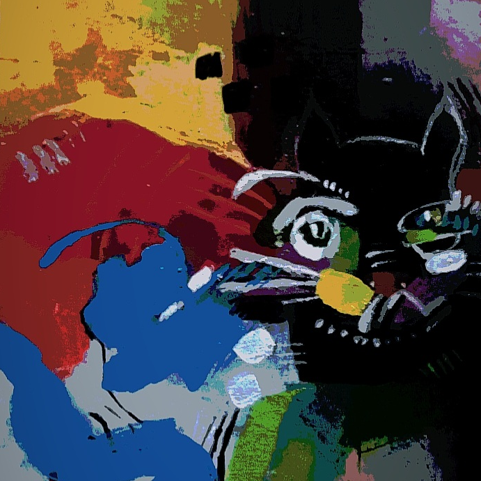

# The Holographic City

In a forgotten alley, Mystique Illusion, a mysterious cat with fur that shimmers like stars, slipped into the Holographic City. Serenity, his owner, dared to enter the alley, but upon doing so, the surroundings transformed into something beyond human comprehension.

**January 31, 2050**

Barking children echo amid steel giants writhing like gelatin. Fragrances of ancient battles waft through nebulas of incense smoke. A carousel of dimensional doors spins on the horizon as electric butterflies dance with shadows of past emperors. Meanwhile, narrow corridors defy geometry, weaving the tapestry of a labyrinth where the city itself seems unaware of its boundaries. The spectrum of ancient statues converses in whispers with holograms of dystopian skyscrapers, merging centuries of styles and eras into an impossible collage.

As invisible bells toll in the twilight amid circuit-tree-lined streets and seas of fluid data. Streets turn into neon rivers, reflecting advertisements of a future that will never come. Android shadows dance in algorithmic steps, echoing ancient tribal dances. Bits clouds float in the skies, forming digital constellations that tell tales of ancestral programmers. The scent of source code and coffee blends at the corners, where holograms of cybernetic poets recite verses of zeros and ones.

At the peak of the night, Serenity roams through avenues of binary light. Architecture twists into fractal spirals, challenging its very existence. Pixelated angel statues shed tears of code, while virtual reality bands crisscross the skies. The song of coded birds intertwines with algorithmic symphonies, creating a cacophony that transcends human understanding.

Lost in the tide of information, Serenity glimpses Mystique Illusion at every corner. The cat, a digital mirage, appears in holograms and reflections, whispering binary secrets. 

* A digital mirage:

