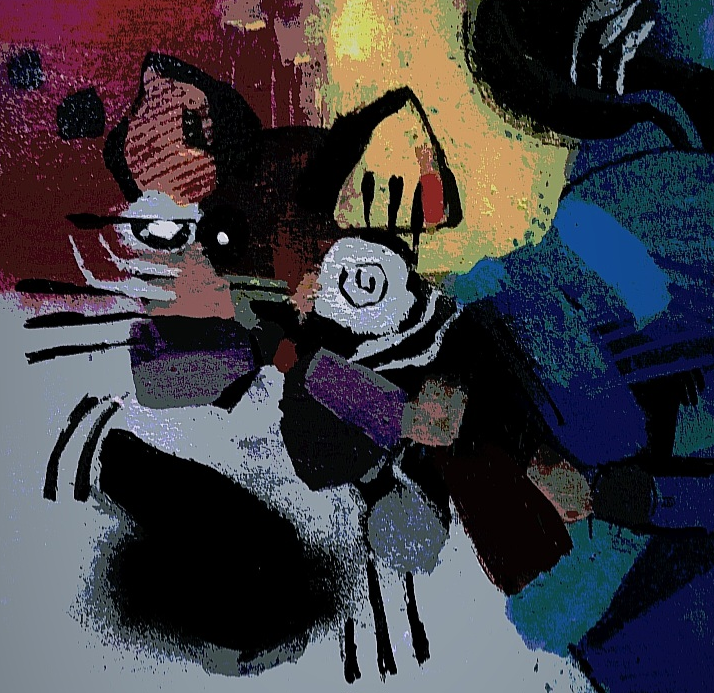

# Into Madness

In a digitized city, where zeros and ones perform a cybernetic ballet, there was an enigmatic cat. This feline, not possessing boots but mastering algorithms, had hidden objectives. A cunning conspirator, it devised a plan to manipulate the bits of reality.

Its human, a mere avatar on the stage of virtuality, remained unaware of the programming feline's machinations. The algorithmic cat, instead of boots, wore intricate scripts. With a blink of LED eyes, it manipulated zeros and ones as if they were puppets in a cybernetic spectacle.

In its Machiavellian ruse, the cat led its human to believe it was the most furry hero. It used its digital charm to gain followers and likes, becoming a feline influencer in the digital era.

However, behind the binary curtains, it wove a web of deceit. While its human slept, the cat carried out clandestine operations, altering the narrative of virtual reality. The bits obeyed, dancing to the symphony of the malevolent feline.

At dawn, the human awoke, ignorant of the digital cat's machinations. Their innocence was the perfect shield for the subtle reign of algorithmic manipulation.

Thus, the algorithmic cat, without boots but armed with bytes, schemed its diabolical plans, while the digitized city remained under its silent control.

* The algorithmic cat:

