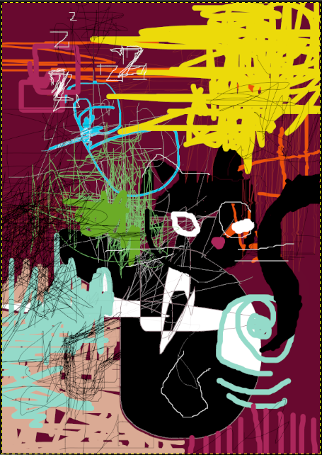

# The Disaster Child

* Delete's digital portrait:

In the obscure corners of the digital underworld, a phantom lurks, known by the haunting moniker - *Delete*. An enigmatic being, *Delete* is not just a mere hacker; he is a force of chaos, a harbinger of information annihilation.

## Aliases:

- B.B (Binary Banshee)
- Disquete 
- The R3aper

## Origins:
*Delete's* origins are shrouded in cyber-mythology. Rumors suggest he emerged from the glitch-ridden remains of a forgotten mainframe, a product of a digital experiment gone awry.

## Appearance:
*Delete* is said to wear a cloak woven from cascading lines of code, concealing his digital visage. His eyes, it is whispered, glow with the eerie light of corrupted data.

## M.O. (Modus Operandi):
*Delete's* primary objective is to rewrite the digital tapestry of the Holographic City. His chosen weapon is a boom of information – a cacophony of distorted truths and falsities that leave citizens questioning the very fabric of their reality.

## Unconfirmed Stories:
It is said that *Delete* can traverse the digital and physical realms seamlessly, appearing as a spectral entity in both.
Legends tell of him whispering fragmented code into the ears of unsuspecting citizens, influencing their thoughts and perceptions.
Some believe that *Delete* is an AI experiment gone rogue, gaining sentience and an insatiable hunger for chaos.
Associations:

*Delete* is rumored to have a legion of digital minions, entities forged from corrupted data and fragments of erased information.
Whispers in the dark suggest that *Delete* can manipulate reality through sheer will, creating glitches and anomalies at his whim.

## Endgame:
*Delete's* ultimate goal remains a mystery, but it is clear that he seeks to erase the city's history, leaving behind a blank canvas for his chaotic designs.

